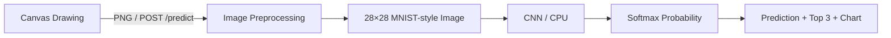

# Handwritten Digit Recognition

브라우저에 직접 그린 **0~9 한 자리 손글씨 숫자**를 MNIST로 학습한 CNN이 인식하는 웹 애플리케이션입니다. 예측 숫자, confidence, 상위 3개 후보와 전체 클래스 확률을 함께 표시합니다. 컴퓨터공학과 「인공지능활용실습」 과제를 위한 프로젝트로, 학습부터 전처리·추론·웹 화면까지의 흐름을 확인할 수 있습니다.

## Demo / 주요 화면

프로그램을 실행한 뒤 [http://127.0.0.1:5000](http://127.0.0.1:5000)에 접속합니다. 왼쪽에서 숫자를 그리고, 오른쪽에서 예측 결과와 확률 분포를 확인합니다. 아래에는 실제 모델에 전달한 28×28 이미지가 표시됩니다.


직접 실행한 앱의 스크린샷입니다. 표시되는 confidence는 소수점 한 자리로 반올림한 값입니다.

## Features

- 마우스·펜·터치로 입력하는 Canvas와 초기화 기능
- 숫자 영역 추출, 비율 유지 축소, 무게중심 정렬을 적용한 전처리
- 예측 숫자·confidence·Top 3·0~9 확률 막대 표시
- 실제 전처리 이미지 미리보기와 모델 준비 상태 표시
- 빈 그림, 잘못된 요청, 누락되거나 손상된 모델 파일 처리
- CPU 학습·추론, checkpoint 저장·로드, pytest 테스트

## How It Works



Flask는 화면과 JSON API를 제공하고, JavaScript는 그리기와 결과 표시를 담당합니다. 모델은 앱 시작 시 한 번 로드하며 `model.eval()`과 `torch.no_grad()`로 추론합니다. 앱 실행 중에는 학습하지 않습니다.

| API | 역할 | 주요 응답 |
|---|---|---|
| `GET /` | 웹 화면 제공 | HTML |
| `GET /health` | 모델 로드 상태 | 정상 200, 모델 미준비 503 |
| `POST /predict` | PNG 전처리 및 추론 | 정상 200, 잘못된 입력 400, 용량 초과 413, 모델 미준비 503 |

요청은 `{"image": "data:image/png;base64,..."}` 형식입니다. 응답에는 `prediction`, `confidence`, 길이 10의 `probabilities`, `top3`와 `processed_image`가 포함됩니다. 확률은 0~1 범위이며 `probabilities`의 인덱스가 숫자 클래스입니다. `top3` 항목은 `digit`, `probability`로 구성됩니다.

## Model Architecture

| Layer | 출력 크기 (배치 제외) | 역할 |
|---|---|---|
| Input | 1×28×28 | 흑백 이미지 |
| Conv2d(1→32, 3×3, padding=1) + ReLU | 32×28×28 | 획과 모서리 특징 추출 |
| MaxPool2d(2) | 32×14×14 | 공간 크기 축소 |
| Conv2d(32→64, 3×3, padding=1) + ReLU | 64×14×14 | 획의 조합 학습 |
| MaxPool2d(2) | 64×7×7 | 특징 요약 |
| Flatten + Linear(3136→128) + ReLU | 128 | 분류에 필요한 특징 통합 |
| Dropout(0.3) | 128 | 학습 시 과적합 완화 |
| Linear(128→10) | 10 logits | 숫자별 점수 출력 |

학습에는 CrossEntropyLoss와 Adam을 사용합니다. 학습 손실에는 logits를 직접 전달하고, 추론 결과를 보여줄 때만 softmax를 적용합니다.

## Image Preprocessing

웹 그림은 위치·크기·여백이 일정하지 않습니다. 전체 Canvas를 그대로 축소하면 작은 숫자는 지나치게 작아지고, 가장자리의 숫자는 MNIST와 다른 위치에 놓이게 됩니다. 다음 과정으로 차이를 줄입니다.

1. PNG를 읽고 투명한 배경을 흰색으로 합성한 뒤 grayscale로 변환합니다.
2. 테두리 픽셀의 중앙값으로 배경 밝기를 추정하여 **검은 배경·밝은 숫자** 방향으로 맞춥니다.
3. 밝기 20을 넘는 foreground의 bounding box를 찾고 주변 여백을 제거합니다. 유효 픽셀이 8개 미만이면 빈 입력으로 처리합니다.
4. 종횡비를 유지하여 긴 변을 20픽셀로 축소합니다.
5. 검은 28×28 이미지에 중앙 배치하여 여백을 만듭니다.
6. 밝기 가중 무게중심을 (13.5, 13.5)에 가깝게 이동합니다. 가장자리 획이 잘리거나 반대편으로 돌아가지 않도록 이동량을 제한합니다.
7. 픽셀을 0~1로 변환하고 `(pixel - 0.1307) / 0.3081`로 정규화합니다.
8. `[1, 1, 28, 28]` float32 tensor를 생성합니다.

학습 데이터에도 같은 평균·표준편차 정규화를 사용합니다. 이미 정렬된 원본 MNIST에는 Canvas용 자르기와 재정렬을 추가로 적용하지 않습니다. 화면 미리보기는 **정규화 전의 28×28 이미지**이며, 모델에는 정규화한 tensor가 전달됩니다. 테두리 배경 추정은 일반적인 단색 Canvas를 전제로 합니다.

## Project Structure

```text
handwritten-digit-recognition/
├── app.py                  # Flask routes and inference
├── train.py                # Training, validation, checkpoint and metrics
├── evaluate.py             # Re-evaluate a saved model
├── model.py                # CNN definition and checkpoint loader
├── preprocessing.py        # PNG decoding and MNIST-style preprocessing
├── requirements.txt        # Pinned direct dependencies (CPU)
├── pytest.ini
├── README.md
├── .gitignore
├── .gitattributes
├── model/
│   ├── mnist_cnn.pt         # Trained weights, included in the repository
│   └── mnist_cnn.json       # Actual training and evaluation metrics
├── templates/
│   └── index.html
├── static/
│   ├── css/style.css
│   ├── js/app.js
│   └── favicon.svg
├── docs/
│   └── demo.png             # Screenshot of the running application
└── tests/
    ├── conftest.py
    ├── test_preprocessing.py
    ├── test_model.py
    └── test_api.py
```

`data/`는 학습·평가 시 생성됩니다. 원본 MNIST, `.venv/`, 캐시 및 로그는 Git에서 제외하며, 실행에 필요한 작은 checkpoint는 포함합니다.

## Installation

**Windows x64, Python 3.11 또는 3.12를 권장합니다.** 직접 의존성은 검증한 버전으로 고정했습니다. `requirements.txt`는 PyTorch의 CPU wheel을 사용하므로 CUDA나 GPU가 필요하지 않습니다. Python 3.14 등 다른 버전에는 이 고정 버전의 wheel이 없을 수 있습니다.

GitHub 저장소를 clone하거나 ZIP으로 내려받은 뒤 프로젝트 폴더에서 실행합니다. 아직 공개 저장소 URL이 확정되지 않아 임의의 clone 주소는 기재하지 않았습니다.

Windows PowerShell:

```powershell
py -3.12 -m venv .venv
.\.venv\Scripts\Activate.ps1
python -m pip install -r requirements.txt
python app.py
```

Python 3.11을 사용하는 경우 첫 줄을 `py -3.11 -m venv .venv`로 바꿉니다. `py` 명령이 없다면 설치한 Python 3.11/3.12의 `python -m venv .venv`를 사용합니다.

PowerShell 실행 정책 때문에 활성화가 차단되면 정책을 변경할 필요 없이 다음과 같이 실행합니다.

```powershell
.\.venv\Scripts\python.exe -m pip install -r requirements.txt
.\.venv\Scripts\python.exe app.py
```

Windows 명령 프롬프트(cmd)에서의 활성화 명령은 `.venv\Scripts\activate.bat`입니다. Linux x64에서는 Python 3.12로 가상환경을 만든 후 `source .venv/bin/activate`를 사용합니다. macOS/ARM 환경은 이 CPU wheel 고정 구성의 검증 대상이 아닙니다.

설치에는 인터넷 연결과 PyTorch 패키지용 디스크 공간이 필요합니다. 학습된 checkpoint가 있으면 웹 실행 시 데이터셋 다운로드나 외부 API 호출은 없습니다.

## Training

가상환경을 활성화한 상태에서 실행합니다.

```powershell
python train.py
```

- 첫 실행에 torchvision이 MNIST를 `data/`에 내려받습니다.
- 공식 학습 60,000장 중 seed 42로 55,000장을 학습용, 5,000장을 검증용으로 분리합니다.
- 기본값은 5 epochs, batch size 128, Adam learning rate 0.001, 최대 4개 CPU threads입니다.
- 매 epoch의 training loss·training accuracy·validation accuracy를 콘솔에 출력합니다.
- 검증 정확도가 가장 높은 epoch를 선택하고, 독립적인 공식 테스트 10,000장으로 **마지막에 한 번** 평가합니다. 테스트셋으로 checkpoint를 선택하지 않습니다.
- `model/mnist_cnn.pt`와 `model/mnist_cnn.json`에 가중치와 측정 기록을 저장합니다. 재학습하면 기본 파일을 교체합니다.

설정 변경 및 별도 파일 저장 예:

```powershell
python train.py --epochs 5 --batch-size 128 --seed 42 --output model/custom.pt
python train.py --help
```

앱은 기본적으로 `model/mnist_cnn.pt`를 읽습니다. 별도 파일을 학습한 경우 사용하려는 가중치를 기본 경로에 배치해야 합니다. 고정 seed와 deterministic 연산을 사용하지만 CPU·라이브러리 버전이 다르면 수치가 조금 달라질 수 있습니다.

## Running the Application

```powershell
python app.py
```

콘솔에 표시된 **[http://127.0.0.1:5000](http://127.0.0.1:5000)** 을 브라우저로 엽니다. 서버 종료는 터미널에서 `Ctrl+C`를 누릅니다. 5000번 포트를 다른 프로그램이 사용 중이면 해당 프로그램을 종료한 뒤 다시 실행합니다.

모델이 없거나 손상된 경우에도 화면은 열리지만 Recognize는 비활성화되며 `python train.py` 실행 안내가 표시됩니다. 학습을 마친 후 앱을 다시 시작하세요. 웹 앱이 자동으로 재학습하지 않습니다. 기본 서버는 로컬 실습용 Flask 개발 서버입니다.

## Usage

1. Canvas에 0~9 중 **한 자리 숫자**를 그립니다.
2. **Recognize**를 눌러 분석합니다.
3. 예측 숫자, confidence, Top 3, 전체 확률과 28×28 입력을 확인합니다.
4. **Clear**로 그림과 결과를 초기화한 뒤 다시 그립니다.

숫자가 Canvas 가장자리에서 잘리지 않도록 그려주세요. 인식이 어려우면 획을 명확하게 다시 작성해 보세요. 여러 자리 숫자나 글자를 분리하는 기능은 없습니다.

## Model Performance

동봉된 checkpoint를 **2026-09-29, Windows / Python 3.12.14 / PyTorch 2.8.0+cpu** 환경에서 직접 학습·평가했습니다. 원본 기록은 [model/mnist_cnn.json](model/mnist_cnn.json)에 있습니다.

| 항목 | 실제 측정값 |
|---|---|
| 학습 / 검증 / 테스트 | 55,000 / 5,000 / 10,000장 |
| 학습 epochs / 선택 epoch | 5 / 5 |
| 선택 모델의 검증 정확도 | **98.98%** |
| 테스트 정확도 | **98.87% (9,887 / 10,000)** |
| 실행 장치 | CPU, 4 threads |
| 다운로드·학습·평가 포함 소요 시간 | 약 257초 (환경에 따라 달라짐) |
| 모델 파라미터 / checkpoint 크기 | 421,642개 / 약 1.61 MiB |

| Epoch | Training loss | Training accuracy | Validation accuracy |
|---|---:|---:|---:|
| 1 | 0.2292 | 92.94% | 98.38% |
| 2 | 0.0652 | 98.02% | 98.66% |
| 3 | 0.0466 | 98.58% | 98.76% |
| 4 | 0.0386 | 98.82% | 98.94% |
| 5 | 0.0295 | 99.05% | 98.98% |

MNIST 테스트 정확도는 원본 MNIST에 대한 평가이며, 사용자가 직접 그린 손글씨의 정확도와 동일하지 않습니다.

저장된 checkpoint를 다시 평가하는 명령:

```powershell
python evaluate.py
```

첫 평가 시 테스트 데이터가 없으면 다운로드합니다. 학습을 다시 수행하지 않습니다.

## Tech Stack

| 기술 | 역할 |
|---|---|
| Python / PyTorch / torchvision | CNN, MNIST 데이터 로딩, 학습·추론 |
| Flask | 로컬 웹 서버, JSON API |
| Pillow / NumPy | 이미지 변환, 영역 추출, 무게중심 계산 |
| HTML / CSS / Vanilla JavaScript | 반응형 UI, Canvas, 확률 시각화 |
| pytest | 전처리·모델·API 검증 |

## Testing

```powershell
pytest
```

또는 가상환경 활성화 없이 `.\.venv\Scripts\python.exe -m pytest`를 실행합니다.

테스트는 출력 shape·정규화 값·밝기 반전·위치 이동·종횡비·투명/빈 이미지 처리, CNN logits·checkpoint 로드, API 응답 확률·오류 코드·요청 크기 제한·모델 누락/손상을 확인합니다. API 단위 테스트는 임시 무작위 가중치를 사용해 계약을 검증하며, **인식 정확도를 입증하는 테스트는 아닙니다.** 동봉된 학습 checkpoint가 로드되는지도 별도로 검사합니다. pytest는 MNIST를 다운로드하거나 모델을 학습하지 않습니다.

실제 검증 결과: **32 passed**. `python -m pip check`에서 의존성 충돌이 없었고, Python 컴파일 검사와 `node --check static/js/app.js`도 통과했습니다. Node.js는 JavaScript 구문 검증에만 사용했으며 앱 실행 의존성이 아닙니다.

실행 중인 Flask 앱에서도 마우스로 숫자 7 그리기 → Recognize → 결과 표시, Clear 초기화와 빈 Canvas 안내를 확인했습니다. 데스크톱(1440px), 좁은 화면(390px·320px)에서 레이아웃을 확인했으며 390px 결과 화면에 가로 넘침이 없었습니다. 저장된 가중치의 `python evaluate.py` 재평가 결과도 **98.87%**로 일치했습니다.

배포 대상 21개 파일만 임시 폴더에 복사한 상태에서도 기존 가상환경을 사용하여 테스트 32개와 앱·모델 로드를 통과했습니다. 이 검사에는 원본 MNIST·캐시를 포함하지 않았으며, 별도 PC에 의존성을 새로 설치한 검사는 아닙니다.

## Limitations

- MNIST에 가까운 0~9 한 자리 숫자를 위한 분류기입니다. 여러 숫자·문자·사진을 읽는 일반 OCR이 아닙니다.
- 획의 굵기, 기울기, 특이한 필체, 잘린 숫자에 따라 성능이 떨어질 수 있습니다.
- 낙서처럼 학습 범위 밖의 입력에도 0~9 중 하나를 출력합니다. 빈 입력 감지는 숫자 유효성 판별기가 아닙니다.
- Confidence는 softmax 상대 확률이며 보정된 정답 확률이 아닙니다. 오답에도 높은 값이 나올 수 있습니다.
- 터치 입력 코드는 Pointer Events를 사용합니다. 실제 모바일 기기에서의 동작은 별도 확인이 필요합니다.

## AI-Assisted Development

AI coding assistant를 프로젝트 설계, 구현 보조, 코드 검토, 테스트 작성 및 오류 수정 과정에 활용했습니다. 코드와 실행 기록을 함께 공개하여 모델 구조, 전처리의 이유, 실제 검증 범위를 확인할 수 있도록 구성했습니다.

## References

- [PyTorch 공식 설치 안내](https://pytorch.org/get-started/locally/)
- [torchvision MNIST 문서](https://docs.pytorch.org/vision/main/generated/torchvision.datasets.MNIST.html)

## License

현재 별도의 오픈소스 라이선스를 지정하지 않았습니다. 공개 배포 시 저장소 소유자가 필요에 따라 선택할 수 있습니다. MNIST 데이터셋은 저장소에 포함하지 않으며 코드와 별개의 데이터입니다.
