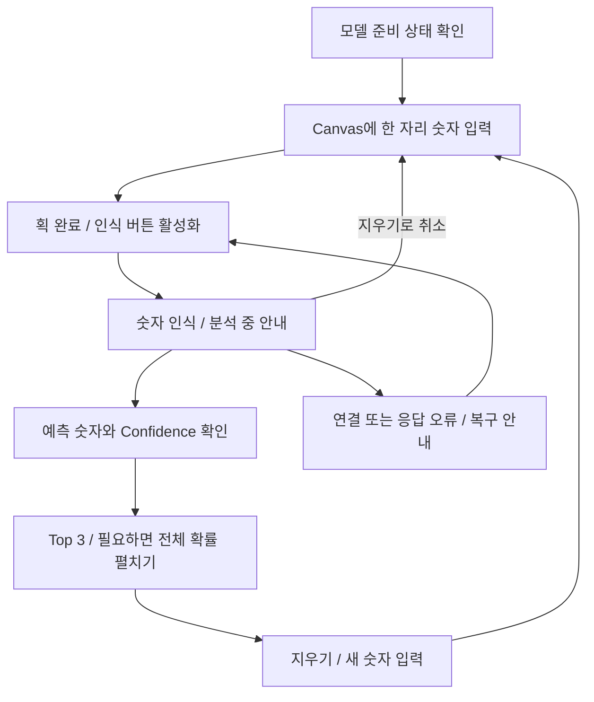
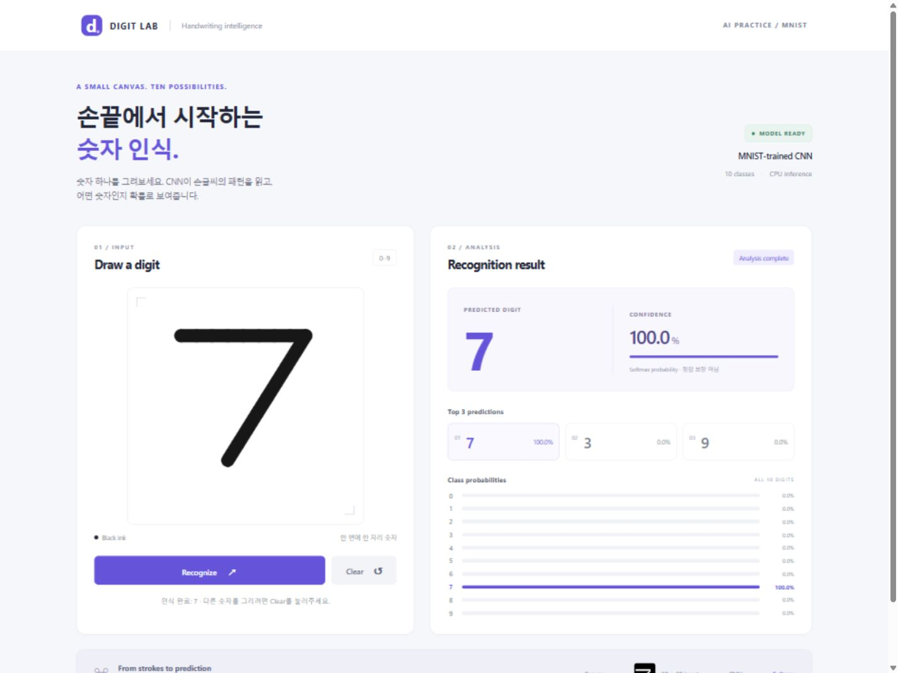
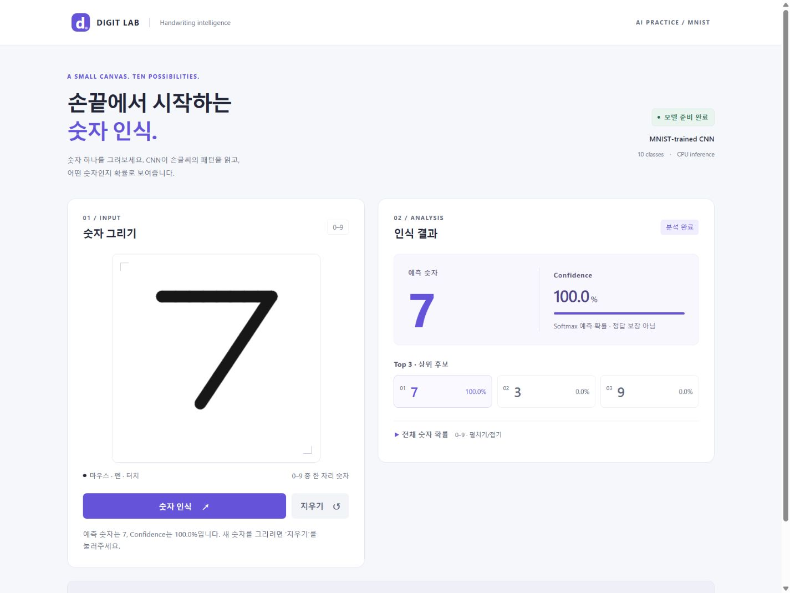

# HCI / UX Refinement

> 이 문서는 v1.1 HCI / UX 개선 시점의 설계 기록입니다. 이후 v1.2의 synthetic persona 기반 평가와 최종 보완은 [Synthetic Beta Evaluation](SYNTHETIC_BETA_EVALUATION.md)에 기록했습니다.

## 1. 목적

기능적으로 완성된 Handwritten Digit Recognition을 **HCI 원칙을 기반으로 한 설계 분석 및 개선** 대상으로 검토했다. 목표는 숫자를 그리는 단계부터 결과 이해와 재시도까지 현재 상태와 다음 행동을 명확하게 전달하는 것이다.

기준 버전은 [`1aa91ca` — Implement MNIST handwritten digit recognition app](https://github.com/gsj118/handwritten-digit-recognition/commit/1aa91ca71273f84b38c794133b3b8e88ac6cf062)이다. v1.1 변경은 [`0c01183` — Improve interaction and UI using HCI principles](https://github.com/gsj118/handwritten-digit-recognition/commit/0c01183c2804ce5e304357efb1a1b9986c36a198)에 기록했다. CNN, 학습된 checkpoint, 전처리, Flask API는 변경하거나 재학습하지 않았다. 기존 98.87% 테스트 정확도는 v1.0의 실측값을 그대로 보존한다.

「휴먼컴퓨터인터페이스」 과목의 학습 범위인 인터랙션 디자인, UI 디자인 방법론, UI 설계를 위한 프로젝트 방법론과 연결해 설계 이유를 기록한다. 특정 교재의 문장이나 강의에서 다루었는지 확인되지 않은 이론을 인용하지 않는다.

## 2. Main User Task

**Draw → Recognize → Understand Result → Clear / Retry**

| 상태 | 화면 안내와 가능한 행동 |
|---|---|
| 모델 준비 필요 | 인식 비활성화, 모델 준비·앱 재시작 안내 |
| 입력 대기 | 숫자를 그려야 활성화된다는 이유 표시 |
| 입력 중 | 획을 마친 뒤 인식하도록 안내 |
| 인식 준비 | 인식 버튼 활성화, 획 추가도 가능 |
| 분석 중 | 버튼·결과 badge 동기화, 중복 요청 방지, 지우기로 취소 가능 |
| 분석 완료 | 숫자·Confidence와 새 입력 방법 안내 |
| 다시 시도 | 원인 범주와 다음 행동 표시, 그림 유지 |

## 3. HCI Review

코드, v1.0 실행 화면, README, 테스트를 먼저 읽고 핵심 태스크를 따라 검토했다. 다음은 설계자의 검토이며 사용자 조사 결과가 아니다.

| 관점 | v1.0 확인 내용 | 판단 |
|---|---|---|
| A. System status visibility | 모델 상태와 메시지가 있으나 분석 중 결과 badge는 이전 상태를 유지 | 입력·분석·완료 상태를 일관되게 표시 |
| B. Feedback | 버튼의 분석 중 표시는 존재, Clear는 초기 안내로만 복귀 | 결과 badge와 초기화·취소 피드백 보완 |
| C. Affordance / Signifiers | Canvas 테두리·힌트와 두 버튼의 우선순위가 명확 | 구조 유지, 입력 조건과 버튼 문구 보완 |
| D. Mapping | 왼쪽 입력/오른쪽 결과와 하단 전처리 흐름이 연결됨 | 현재 구현 유지 |
| E. Consistency | 한국어 안내와 영어 행동·상태·오류 문구 혼용 | 행동·상태는 한국어, 기술 용어·브랜드는 유지 |
| F. Error prevention | 빈 입력의 클릭 핸들러, 모델 준비 검사, 중복 클릭 방지가 이미 존재 | 빈 입력·획 입력 중에도 버튼 비활성화 |
| G. Error recovery | `error.message`를 그대로 표시하여 연결·JSON 오류가 기술 문구로 노출될 수 있음 | 원인 범주별 한국어 복구 행동 안내 |
| H. User control and freedom | AbortController, timeout, revision 검사, 지우기·새 획으로 취소 가능 | 기존 취소 방식을 유지하고 회귀 테스트 추가 |
| I. Information hierarchy | 가장 큰 예측 숫자, Confidence, Top 3 순서가 명확 | 핵심 결과의 순서 유지 |
| J. Cognitive load | 전체 확률 10행이 항상 노출됨 | 세부 확률만 선택적으로 펼치기 |
| K. Recognition rather than recall | 짧은 Canvas 안내는 존재 | 상태별로 다음 행동을 바로 표시 |
| L. Accessibility | native button, focus-visible, status 영역, Pointer Events, reduced motion 존재 | 설명 연결·결과 요약·대비·상세 영역 키보드 조작 보완 |
| M. Responsive interaction | 작은 화면에서 세로 배치, Canvas 크기와 좌표 변환 처리 | 기존 breakpoint 유지, 390px에서 회귀 검증 |

## 4. Problems Identified

- **빈 입력에서도 인식 버튼이 활성화되어 있었다.** 기존에도 클릭 뒤 안내하고 서버 요청은 막았지만, 사용할 수 없는 행동이 사용 가능한 것처럼 보였다.
- **분석 상태가 화면 안에서 일치하지 않았다.** 버튼과 메시지는 분석 중을 표시했으나 결과 badge와 이전 예측값은 남아 있을 수 있었다.
- **Clear의 결과가 명시되지 않았다.** 초기 안내로만 돌아가 그림·결과 초기화와 진행 중 요청 취소를 구분하기 어려웠다.
- **오류 설명의 언어와 복구 안내가 불균일했다.** API의 영어 오류나 브라우저의 `Failed to fetch`, JSON 파싱 오류가 그대로 보일 수 있었다.
- **일상적인 행동과 상태 문구가 한국어·영어로 혼용되어 있었다.** 기술 용어를 유지하더라도 행동 안내까지 영어일 필요는 없었다.
- **상세 확률의 노출을 선택할 수 없었다.** 모든 후보를 보려는 경우가 아니어도 10행을 항상 지나가야 했다.
- **상태·확률·보조 안내가 작고 흐렸다.** 예를 들어 상태 문구는 11px, 확률 수치는 9px였고, 상태 글자 `#9297a6`와 흰 배경의 대비는 약 2.92:1이었다.

## 5. Improvements

### Improvement 1 — 입력 조건에 따른 행동 가능 상태

- **Before:** 모델만 준비되면 빈 Canvas에서도 Recognize가 활성화됨.
- **Problem:** 사용할 수 없는 행동을 누른 후에야 조건을 알게 됨.
- **Change:** 입력 없음·획 입력 중·요청 중·모델 미준비를 동일한 제어 함수에서 검사하고 native `disabled`로 표시. 바로 아래에 활성화 조건을 설명하고 버튼과 `aria-describedby`로 연결.
- **Reason:** 실패를 경험하기 전에 필요한 행동을 알 수 있게 한다. 내부 클릭 가드도 유지하여 UI 밖에서 호출되는 경우의 중복 요청을 방지한다.

### Improvement 2 — 요청·결과·초기화 피드백 일치

- **Before:** 분석 중에도 결과 badge나 이전 예측이 남을 수 있고, Clear는 초기 문구로만 복귀.
- **Problem:** 현재 입력의 결과인지, 요청이 처리 중인지 구별하기 어려움.
- **Change:** 입력 대기/입력 중/인식 준비/분석 중/분석 완료/다시 시도/모델 준비 필요 상태를 badge와 버튼·메시지에 반영. 새 요청 시 이전 결과·미리보기를 비우고, 지우기 후 초기화 또는 취소 사실을 명시.
- **Reason:** 같은 상태에 서로 다른 메시지가 나타나는 것을 줄이고 행동의 완료를 확인할 수 있게 한다. 요청 취소·15초 timeout·revision 검사는 기존 방식을 유지한다.

### Improvement 3 — 원인과 다음 행동을 함께 알리는 오류 안내

- **Before:** 서버 또는 브라우저 예외의 `error.message`를 직접 표시.
- **Problem:** 기술 오류를 이해하거나 복구 방법을 추측해야 함.
- **Change:** 입력 오류(400), 크기 초과(413), 모델 미준비(503), 기타 서버 실패, 연결 실패, timeout, 응답 해석 실패에 맞는 한국어 안내를 표시. 그림은 보존하고 재시도·지우기·새로고침·앱 상태 확인 중 적절한 행동을 안내.
- **Reason:** API 응답 계약을 바꾸지 않고 화면에서 오류를 이해하고 회복할 수 있게 한다. 모델 누락 화면에는 실제 준비 방법도 표시한다.

### Improvement 4 — 행동과 상태 문구의 언어 일관성

- **Before:** Recognize/Clear, 영어 상태 badge, 한국어 안내가 섞여 있음.
- **Problem:** 안내문에서 설명한 행동과 버튼을 다시 대응시켜야 함.
- **Change:** 버튼을 ‘숫자 인식’/‘지우기’, 영역 제목을 ‘숫자 그리기’/‘인식 결과’로 변경하고 안내도 같은 표현 사용.
- **Reason:** 일상적인 조작 표현을 맞춘다. Digit Lab, MNIST, CNN, Confidence, Top 3, Softmax는 그대로 유지한다.

### Improvement 5 — 상세 확률의 선택적 확인

- **Before:** 예측 숫자·Confidence·Top 3와 10개 확률이 항상 함께 표시.
- **Problem:** 핵심 결과만 보려는 경우에도 세부 분석을 같은 화면 밀도로 접하게 됨.
- **Change:** 예측·Confidence·Top 3는 상시 표시하고 전체 확률만 native `details`/`summary`로 묶어 기본적으로 접음. 펼침 상태는 그림 변경·인식·지우기 때 강제로 바꾸지 않음.
- **Reason:** 정보는 모두 유지하면서 확인 시점을 사용자가 선택하게 한다. native 요소가 키보드 조작과 펼침 상태 전달을 담당하므로 별도의 ARIA 토글이나 JavaScript 버튼을 만들지 않는다.

### Improvement 6 — 설명 연결과 결과 요약 전달

- **Before:** Canvas의 영어 label과 상태 메시지가 있었고, 인식 완료 안내에는 Confidence가 없었음.
- **Problem:** 입력 방법과 결과 전체를 파악하려면 여러 곳을 따로 읽어야 함.
- **Change:** Canvas의 한국어 이름·입력 방법 설명을 연결하고, 기존 `role="status"` 영역에서 숫자·Confidence·다음 행동을 한 문장으로 전달. `aria-atomic="true"`를 명시하고 결과 영역의 `aria-busy`를 상태와 동기화. 상세 확률 summary에도 focus-visible 적용.
- **Reason:** 기존 status 영역을 활용해 중복 live region을 늘리지 않는다. 결과가 나올 때 포커스를 강제로 이동시키지 않으며, 키보드 그리기를 지원한다고 주장하지 않는다.

### Improvement 7 — 핵심 안내와 수치의 가독성

- **Before:** 흐린 상태 안내와 작은 확률 수치, 밝은 focus outline.
- **Problem:** 핵심 태스크의 안내와 분석 수치를 읽기 어려울 수 있음.
- **Change:** 상태 문구를 13px, 확률 수치를 12px로 조정하고 주요 텍스트 색을 진하게 변경. 보라색 accent를 focus outline에도 사용. 버튼과 상세 확률 summary는 최소 46px 높이로 유지·확보. 중복 680px media query와 사용하지 않는 기존 selector를 정리.
- **Reason:** 색상만으로 상태를 전달하지 않으면서 읽기와 조작을 돕는다. 흰색 배경·보라색 정체성과 기존 breakpoint는 유지한다.

실행 화면의 CSS 색으로 계산한 대비는 상태 안내/확률 수치 **5.49:1**, Confidence 보조 안내 **5.77:1**, 모델 준비 badge **5.80:1**, summary **6.74:1**이었다. 일반 텍스트 대비를 검토할 때 [W3C의 1.4.3 설명](https://www.w3.org/WAI/WCAG22/Understanding/contrast-minimum.html)을 참고했다. 이는 해당 색 조합의 확인이며 전체 WCAG 준수 인증이 아니다.

## 6. Preserved Design Decisions

- 흰색·밝은 배경, 보라색 accent, Digit Lab branding.
- 데스크톱의 왼쪽 Canvas / 오른쪽 결과, 모바일의 위아래 배치.
- 예측 숫자를 가장 크게 표시하고 Confidence → Top 3로 이어지는 순서.
- Canvas → 28×28 input → CNN → Softmax 흐름과 실제 전처리 이미지.
- 인식 primary action과 지우기 secondary action의 구분.
- Pointer Events, 좌표 비율 변환, pointer capture, 획 처리.
- 요청 취소, timeout, 이전 응답 무시, 모델 준비 검사.
- Flask/API, CNN 구조, 학습 가중치와 측정 지표, 기존 Python 테스트 32개.

### 실제 화면 비교

**v1.0 baseline:** 기존 이미지는 그대로 보존했다.

**v1.1 HCI refinement:** 실행한 앱에서 직접 숫자 7을 그려 인식한 화면이다. 상세 확률은 기본 접힘 상태이다.

### 개발 중 수행한 회귀 검증

| 검증 | 실제 결과와 범위 |
|---|---|
| 기존 Python 테스트 | 수정 전·후 모두 `32 passed`; 전처리, 모델 로드, API 정상/빈 입력/잘못된 요청/모델 누락 포함 |
| JavaScript 구문 | `node --check static/js/app.js` 통과 |
| UI 상태 테스트 | `node --test tests/ui_state.test.cjs`: 8개 통과 |
| UI 테스트 방식 | 실제 `app.js`를 최소 DOM 대역과 제어된 fetch/timer로 실행. 중복 요청, JSON 해석 중 Clear, 새 요청과 이전 응답 충돌, timeout·HTTP·연결·응답 오류, 모델 미준비 검증 |
| Flask 실행 | 기존 가중치 로드, 페이지 및 health 응답 확인; 모델 누락 시 준비 안내도 별도 app factory로 확인 |
| 데스크톱 브라우저 | 1440×1080: 실제 획 입력 → 7 인식, Confidence/Top 3/확률/28×28 미리보기, Clear 후 입력 대기 확인 |
| 키보드 | 지우기에서 Tab으로 summary 이동, focus outline 확인, Enter로 전체 확률 펼치기 확인 |
| 좁은 화면 | 390×844: 실제 획 입력·7 인식·펼친 상세 결과 확인. 버튼 높이 46px, 가로 넘침 없음. 320px도 가로 넘침 확인 |
| 실제 오류 복구 | 로컬 서버를 잠시 중지 → 분석 중 표시 → 연결 오류 안내 → 서버 재시작 → 같은 그림으로 재인식 성공 |
| 원본 보존 | `1aa91ca`와 비교해 backend·모델·학습 지표·`docs/demo.png`가 동일한지 Git 및 해시로 점검 |

브라우저 검증은 개발 과정의 기능 회귀 검증이다. 사용자 대상 usability test와 구분한다. 테스트 코드는 DOM 대역을 사용하므로 실제 레이아웃, 브라우저별 동작, 스크린리더의 음성 출력을 입증하지 않는다.

## 7. Limitations

이번 개선은 HCI 원칙을 기반으로 한 설계 개선이며 **실제 사용자 대상 usability test를 수행한 것은 아니다.** 작업 시간, 오류율, 만족도를 측정하지 않았으므로 객관적인 사용자 만족도 향상을 주장하지 않는다.

- Canvas 그리기는 마우스·펜·터치 입력을 전제로 한다. 키보드만으로 숫자를 그리는 대체 입력은 없다.
- 실제 모바일 하드웨어·터치·펜과 스크린리더 음성 출력은 별도로 검증하지 않았다.
- 전체 확률은 펼치는 행동이 한 번 더 필요하다. 이 선택이 실제 사용자에게 적절한지는 추후 관찰이 필요하다.
- 빈 입력 예방은 획 존재 여부를 기준으로 하며, 낙서가 올바른 숫자인지 판별하지 않는다.
- 모델 정확도, confidence의 의미, MNIST와 실제 필체 차이에 따른 한계는 v1.0과 동일하다.

접근성 구현 검토에는 [W3C Status Messages 설명](https://www.w3.org/WAI/WCAG22/Understanding/status-messages.html)과 [MDN details 문서](https://developer.mozilla.org/en-US/docs/Web/HTML/Reference/Elements/details)를 참고했다. 이 자료들을 특정 강의나 교재에서 배웠다고 전제하지 않는다.
