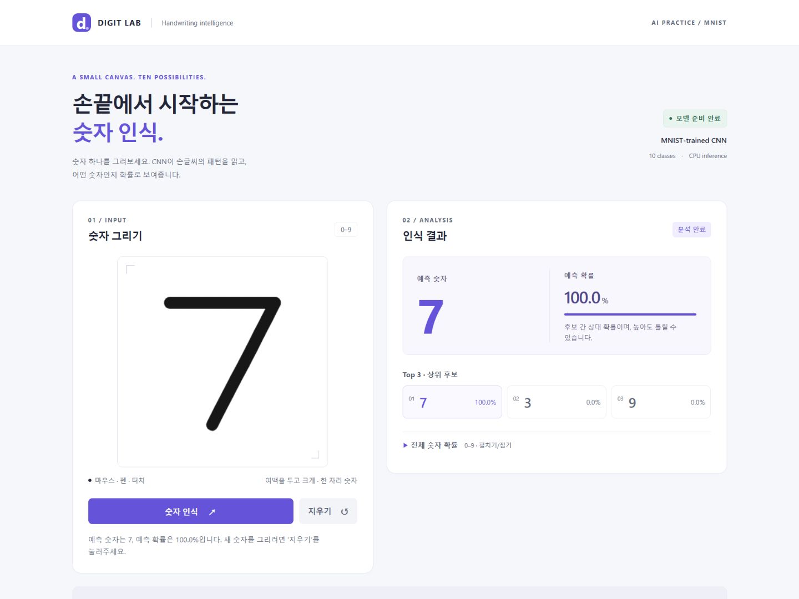

# Synthetic Beta Evaluation

이 평가는 실제 사용자 모집을 통한 usability test가 아니라, 다양한 사용자 상황을 가정한 **synthetic persona와 scenario**를 통해 인터페이스의 잠재적 문제를 탐색한 개발 단계 평가이다. 실제 참여자는 없으며, 사용자 만족도나 사용성 향상을 입증하지 않는다. 아래 피드백은 개발 도구로 확인한 관찰과 설계상 해석이며 인터뷰 발언이 아니다.

## 1. Purpose

완성된 v1.1을 다양한 상황에서 다시 사용하고, 중복 피드백을 통합한 뒤 수정 가치가 있는 부분만 v1.2에 반영한다. 수정 개수를 늘리거나 새로운 모델 성능을 주장하는 작업이 아니다.

## 2. Scope

- v1.0 최초 구현: [`1aa91ca` — Implement MNIST handwritten digit recognition app](https://github.com/gsj118/handwritten-digit-recognition/commit/1aa91ca71273f84b38c794133b3b8e88ac6cf062).
- v1.1 평가 기준: [`0c01183` — Improve interaction and UI using HCI principles](https://github.com/gsj118/handwritten-digit-recognition/commit/0c01183c2804ce5e304357efb1a1b9986c36a198).
- v1.2 최종 보완: [`33be6cd` — Finalize app after synthetic beta evaluation](https://github.com/gsj118/handwritten-digit-recognition/commit/33be6cda94228908efc4c7c0ee246584c058c1ed).
- Canvas → 인식 → 결과 → 상세 확률 → 지우기 → 재시도, 좁은 화면, 키보드, 연결 오류, 늦은 응답을 검토했다.
- CNN, checkpoint, 전처리, Flask API, v1.1 상태 제어와 시각적 정체성은 유지했다.
- 기존 MNIST test accuracy **98.87%**, validation accuracy **98.98%**는 이전 측정값이다. 재학습하거나 새 정확도를 측정하지 않았다.
- 이전 설계 및 화면: [HCI 기록](HCI_UX_REFINEMENT.md), [v1.0](demo.png), [v1.1](hci_after.png).

## 3. Method

2026-09-29 Windows 환경에서 Python pytest, Node.js 구문·UI 상태 테스트를 먼저 실행했다. baseline은 **pytest 32 passed / UI 8 passed**였다. 로컬 Flask 앱을 시작한 뒤 Codex 내장 브라우저에서 실제 버튼·Canvas·키보드 입력을 조작했다.

10개 persona는 서로 다른 검토 관점이다. 10명의 참여자나 독립된 평가자를 뜻하지 않으며 모든 시나리오는 같은 개발 에이전트가 수행했다. persona를 가정했다고 해서 해당 집단의 이해도·정서·행동을 측정할 수 있는 것은 아니다.

화면 크기는 1440×1080, 390×844, 320×844로 설정했다. 좁은 화면에서도 마우스로 조작했으며 실제 터치나 모바일 하드웨어를 사용하지 않았다. 숫자는 Canvas 위에서 자동화된 마우스 drag를 이어 그렸다. 곡선도 짧은 직선과 여러 획으로 근사했으므로 사람의 자연스러운 필체 표본이 아니다. 클릭·drag 사이에 의도적인 대기는 넣지 않았지만 실제 빠른 필기의 속도·압력은 재현하지 못했다.

네트워크 오류는 해당 작업에서 시작한 서버를 중지해 재현했다. 정상 응답이 빨라 분석 중 취소를 분리해서 보기 위해, 별도 로컬 서버에서 `/predict` 처리 전에 3초를 기다리는 임시 평가 wrapper도 사용했다. 제품 API 코드를 바꾸지 않았고 wrapper와 로그는 Git에서 제외했다. 이 조건에서 분석 중 상태, 지우기 취소, 늦은 응답 후 빈 상태 유지, 재입력 성공을 확인했다. DOM 대역을 사용하는 기존 UI 테스트는 브라우저 검증과 구분한다.

Severity는 Critical / Major / Moderate / Minor / None, Confidence는 관찰·해석의 확신 정도다. 화면 재현의 확신과 실제 사용자가 겪을 불편에 대한 확신은 같지 않다.

## 4. Synthetic Personas

| Persona | 가정한 성격과 목표 |
|---|---|
| A — First-time User | 설명서를 먼저 읽지 않고 한 자리 숫자를 인식하려는 대학생 관점 |
| B — Low Digital Literacy User | 기술 용어보다 버튼·안내 문구에 의존하는 관점 |
| C — Impatient User | 반복 클릭하고 완료 전에 지우거나 다시 입력하는 관점 |
| D — Mobile User | 390px에서 그리기·버튼·결과를 오가는 관점; 터치는 가정만 함 |
| E — Very Small Screen User | 320px에서 작은 결과와 펼친 확률을 확인하는 관점 |
| F — AI Beginner | 예측과 확률의 의미를 구분하려는 관점 |
| G — AI / CS Student | Top 3·전체 분포·28×28 입력 및 모델 설명을 확인하는 관점 |
| H — Keyboard-oriented User | Tab·Enter·Space로 가능한 조작 범위를 확인하는 관점 |
| I — Error-prone User | 빈 입력, 오류, 취소, 재시도에서 회복하려는 관점 |
| J — Unusual Handwriting User | 크기·위치·기울기·여러 획이 다른 숫자를 그리는 관점 |

## 5. Scenario Matrix

| ID / Persona | 실제 수행한 시나리오 | 관찰 결과 |
|---|---|---|
| S-A / A | 초기 화면 → 7 그리기 → 인식 | 빈 입력 비활성, 획 후 활성화, 7 / 100.0% 표시 |
| S-B / B | 지우기 → 1 그리기 → 인식 → 상세 열고 닫기 | 초기화 안내, 1 / 100.0%, 상세 제어 정상 |
| S-C / C | 인식 더블클릭 → 지우기; 3초 지연 서버에서 분석 중 지우기 → 재입력 | 빈 상태 유지, 지연 조건에서 취소 안내·늦은 응답 무시·재인식 7 확인 |
| S-D / D | 390px → 7 → 인식 → 상세 펼치기 | 7 / 100.0%, 버튼 46px, 가로 넘침 없음 |
| S-E / E | 320px 펼친 결과 확인 → 지우기 → 1 → 인식 → 상세 토글 | 1 / 100.0%, 가로 넘침 없음; 확률 설명의 단어 중간 줄바꿈 관찰 |
| S-F / F | 7 인식 후 숫자·확률·주의 문구 읽기 | 100.0%는 반올림 표시; 영어 Confidence와 Softmax 용어가 남아 있음 |
| S-G / G | 결과에서 전체 확률 열기, 모델 입력 확인; README 기술 설명 검토 | 확률 10행, 실제 이미지 natural size 28×28, 구조·전처리 설명 존재 |
| S-H / H | 지우기 버튼에서 Tab → summary → Enter → Space | SUMMARY focus, solid outline, 열림→닫힘→열림 정상; 키보드 그리기는 없음 |
| S-I / I | 빈 상태 확인 → 서버 중지 후 인식 → 오류 → 지우기 → 서버 재시작 → 7 재입력 | 한국어 연결 오류, 재시도 가능한 상태, 초기화, 복구 후 7 확인 |
| S-J / J | 0~9 및 크기·위치·기울기·가장자리 변형 | 모든 요청이 결과를 반환; 아래 예시 중 오인식도 확인 |

### 입력 예시 기록

확률은 화면에 표시된 소수점 한 자리 값이다. 일반 스타일 1·7은 S-B·S-A, 나머지는 S-J에서 수행했다. 예시별 의도 숫자와 모델 결과를 기록할 뿐 성공률로 집계하지 않는다.

| 의도 숫자 | 입력 스타일 | 예측 | 표시 확률 |
|---|---|---|---|
| 0 | 일반 크기, 여러 직선으로 둥근 형태 근사 | 0 | 99.8% |
| 1 | 세로 한 획 | 1 | 100.0% |
| 2 | 일반 크기 | 2 | 100.0% |
| 3 | 불완전한 곡선 근사 | 3 | 100.0% |
| 4 | 분리된 여러 획 | 4 | 100.0% |
| 5 | 일반 크기 | 5 | 100.0% |
| 6 | 각진 곡선·여러 획 | **5** | **99.5%** |
| 7 | 이어서 입력한 두 drag | 7 | 100.0% |
| 8 | 교차하는 여러 획 | 8 | 99.1% |
| 9 | 일반 크기 | 9 | 100.0% |
| 2 | 중심 기준 좌표 범위를 일반형의 20%로 축소 | **8** | **67.8%** |
| 0 | 중심 기준 좌표 범위를 일반형의 140%로 확대 | 0 | 98.7% |
| 9 | 일반형 65% 크기로 우측 상단에 배치 | 9 | 100.0% |
| 2 | 세로 위치에 비례해 가로 좌표를 이동한 가벼운 기울기 | 2 | 100.0% |
| 4 | 가장 왼쪽 획이 Canvas 너비 약 3% 지점에 위치 | 4 | 100.0% |

선 두께는 앱 기본값을 유지했다. 매우 작은 입력에서는 같은 선 두께 때문에 획이 뭉칠 수 있다. 6의 근사 형태도 자연스러운 필체와 다르다. 이 결과는 특정 자동화 입력의 관찰이며 모델 전체 성능의 결함이나 개선 효과를 입증하지 않는다.

## 6. Persona Feedback

### A — First-time User

- **Persona:** 처음 접하는 대학생이라는 synthetic 관점.
- **Goal:** README 없이 그리기와 인식을 시작한다.
- **Scenario:** S-A.
- **What worked well:** 입력 장소·0–9·비활성 이유·완료 후 지우기 안내가 연결됐다.
- **Observed friction:** 이 시나리오에서 구체적 장애 없음.
- **Issue:** 없음.
- **Severity:** None. **Confidence:** High(동작 관찰).
- **Suggested improvement:** 현재 시작 흐름 유지.
- **Evidence:** 초기 disabled, 획 후 활성화, 7 결과와 완료 status.

### B — Low Digital Literacy User

- **Persona:** 기술 용어에 익숙하지 않다는 synthetic 관점.
- **Goal:** 버튼과 안내만으로 재입력하고 결과를 이해한다.
- **Scenario:** S-B.
- **What worked well:** 지우기와 숫자 인식은 한국어이고 초기화 결과가 명시됐다.
- **Observed friction:** 결과 제목 Confidence와 설명 Softmax는 별도 배경지식을 요구할 가능성이 있다.
- **Issue:** F-01, 확률 설명을 더 쉽게 쓸 여지.
- **Severity:** Minor. **Confidence:** Medium(이해도는 측정하지 않음).
- **Suggested improvement:** 사용자 화면에는 한국어 표현, 기술 설명은 README 유지.
- **Evidence:** 1 / 100.0% 결과 및 해당 label·caption의 실제 텍스트.

### C — Impatient User

- **Persona:** 빠르게 반복 조작한다는 synthetic 관점.
- **Goal:** 완료 전에 취소하고 바로 다시 시작한다.
- **Scenario:** S-C, 지연 조건은 Method에 별도 명시.
- **What worked well:** 분석 중 버튼 비활성·취소 안내, 취소 뒤 빈 상태 유지, 재인식 성공.
- **Observed friction:** 재현된 상태 충돌 없음.
- **Issue:** 없음.
- **Severity:** None. **Confidence:** High(검증한 순서에 한함).
- **Suggested improvement:** 기존 revision/AbortController와 회귀 테스트 유지.
- **Evidence:** processing → clear → empty, 3초 이후에도 이전 결과 없음, 다음 7 완료.

### D — Mobile User

- **Persona:** 390px 화면에서 사용한다는 synthetic 관점.
- **Goal:** 입력부터 펼친 결과까지 확인한다.
- **Scenario:** S-D, 마우스 입력.
- **What worked well:** 세로 배치, 46px 버튼, 확률 상세 표시.
- **Observed friction:** 결과로 이동하려면 세로 스크롤이 필요하나 조작을 막지는 않았다.
- **Issue:** F-04, 자동 스크롤/고정 버튼 도입 여부 검토.
- **Severity:** Minor. **Confidence:** Low(터치 조작성 미검증).
- **Suggested improvement:** 근거가 부족하므로 현재 배치 유지.
- **Evidence:** viewport 390px, document scrollWidth 375px.

### E — Very Small Screen User

- **Persona:** 320px에서 결과를 읽는 synthetic 관점.
- **Goal:** 숫자·확률·상세를 가로 이동 없이 읽는다.
- **Scenario:** S-E.
- **What worked well:** 100.0%와 10행이 패널 안에 표시됐고 가로 넘침이 없었다.
- **Observed friction:** 기존 확률 caption에서 ‘확률’과 ‘아님’이 단어 중간에서 줄바꿈됐다.
- **Issue:** F-01, 설명 문구와 줄바꿈 보완.
- **Severity:** Minor. **Confidence:** High(시각 관찰), 이해 영향은 미측정.
- **Suggested improvement:** 설명을 쉽게 바꾸면서 단어 단위 줄바꿈 적용.
- **Evidence:** 320px 실행 화면, document scrollWidth 305px.

### F — AI Beginner

- **Persona:** 모델 확률을 정답 보장과 혼동할 수 있다는 synthetic 관점.
- **Goal:** 예측 숫자와 확률의 의미를 구분한다.
- **Scenario:** S-F; S-J의 오인식 결과도 함께 해석.
- **What worked well:** 기존에도 정답 보장 아님이라는 주의가 결과 근처에 있었다.
- **Observed friction:** 영어·전문 용어가 남아 있고 높은 값의 오답 사례가 관찰됐다.
- **Issue:** F-01, 주의를 쉬운 문장으로 명시.
- **Severity:** Minor. **Confidence:** Medium(실제 오해를 관찰한 것은 아님).
- **Suggested improvement:** ‘후보 간 상대 확률이며, 높아도 틀릴 수 있습니다.’로 설명.
- **Evidence:** 7 / 100.0%, 의도 6 → 5 / 99.5%; 반올림·확률 의미는 기존 README에 있음.

### G — AI / CS Student

- **Persona:** 모델 처리 과정에 관심이 있다는 synthetic 관점.
- **Goal:** 전체 분포와 전처리 입력을 확인한다.
- **Scenario:** S-G.
- **What worked well:** 모든 10개 확률과 28×28 이미지가 남아 있으며 README에서 CNN·정규화 과정을 확인 가능.
- **Observed friction:** 이 목표를 막는 정보 누락 없음.
- **Issue:** 없음.
- **Severity:** None. **Confidence:** High(정보 존재와 조작 확인).
- **Suggested improvement:** 기술 용어를 위한 팝업·새 도움말 기능은 추가하지 않음.
- **Evidence:** details.open=true, preview naturalWidth/naturalHeight=28, README 해당 절.

### H — Keyboard-oriented User

- **Persona:** 키보드를 선호한다는 synthetic 관점.
- **Goal:** focus와 상세 토글, 입력 가능 범위를 확인한다.
- **Scenario:** S-H.
- **What worked well:** Tab으로 summary에 도달하고 outline, Enter·Space 토글 정상.
- **Observed friction:** 키보드만으로 Canvas에 숫자를 그릴 수 없다.
- **Issue:** F-03, 기존 접근성 범위의 한계.
- **Severity:** Major(키보드 전용 입력 목표). **Confidence:** High.
- **Suggested improvement:** 대체 입력은 별도 요구사항·설계로 검토하고 현재 한계를 공개.
- **Evidence:** 실제 Tab 순회와 Canvas 구현·대체 텍스트. 스크린리더 검증은 아님.

### I — Error-prone User

- **Persona:** 빈 입력·잘못된 순서·연결 실패를 만난다는 synthetic 관점.
- **Goal:** 오류 후 다시 인식한다.
- **Scenario:** S-I 및 S-C 취소 흐름.
- **What worked well:** 빈 입력 방지, 한국어 연결 복구 안내, 오류 후 초기화·재시도 성공.
- **Observed friction:** 확인한 조건에서 복구 장애 없음.
- **Issue:** 없음.
- **Severity:** None. **Confidence:** High(검증한 오류 범위).
- **Suggested improvement:** 현재 복구 흐름 유지.
- **Evidence:** 서버 중지 → error → clear → empty → 서버 재시작 → 7 완료.

### J — Unusual Handwriting User

- **Persona:** 작거나 치우치고 불완전한 숫자를 입력한다는 synthetic 관점.
- **Goal:** 입력 형태가 달라도 결과와 다음 행동을 확인한다.
- **Scenario:** S-J와 입력 예시 표.
- **What worked well:** 위치·크기 변형 요청들이 결과를 반환하고 여러 획이 유지됐다.
- **Observed friction:** 매우 작은 2 → 8, 각진 6 → 5; 입력 옆에는 크기·여백 안내가 없었다.
- **Issue:** F-02, 입력 안내 부족과 모델/필체 한계.
- **Severity:** Moderate(해당 예시의 오인식). **Confidence:** High(예시 결과), 일반화는 Low.
- **Suggested improvement:** 크기·여백 안내까지만 반영. 모델 재학습은 별도 평가 없이는 하지 않음.
- **Evidence:** 작은 2 / 67.8%, 의도 6 → 5 / 99.5%, 기본 19px 선 두께 및 입력 안내 문구.

## 7. Consolidated Findings

| ID | Issue | Affected personas | Severity | Reproducibility | Impact | Fix cost | Decision |
|---|---|---|---|---|---|---|---|
| F-01 | 확률의 전문 용어와 320px 설명 줄바꿈 | B, E, F | Minor | 화면 문구·줄바꿈 재현, 실제 오해는 미측정 | 결과 해석 가능성 | 낮음 | ACCEPT |
| F-02 | 아주 작은/불완전 입력의 오인식과 크기·여백 안내 부재 | J, A | Moderate | 위 특정 예시에서 관찰; 일반 필체 재현율 미측정 | 해당 입력의 잘못된 예측 | 안내 낮음 / 모델 개선 높음 | PARTIAL |
| F-03 | 키보드 전용 숫자 입력 없음 | H | Major | 구현과 Tab 순회로 확인 | 키보드 전용 태스크 불가 | 높음 | DEFER |
| F-04 | 좁은 화면 결과 이동을 위한 자동 스크롤/고정 버튼 제안 | D, E | Minor | 세로 이동은 관찰; 불편 크기는 미측정 | 추가 이동 가능성 | 중간 | REJECT |

Critical 문제나 새 interaction bug는 발견하지 못했다. None인 관점은 억지로 issue로 만들지 않았다. 기존 키보드 입력 한계를 Major로 분류한 것은 전체 앱이 모든 접근성 요구를 충족한다는 인상을 피하기 위해서다.

## 8. Accepted Improvements

### F-01 — 확률 설명과 좁은 화면 가독성

- **Issue:** 전문 용어를 전제로 한 label·caption과 작은 화면의 단어 중간 줄바꿈.
- **Decision:** ACCEPT.
- **Change:** 화면 label과 완료 status의 Confidence를 ‘예측 확률’로 표시. 결과 옆에 ‘후보 간 상대 확률이며, 높아도 틀릴 수 있습니다.’ 표시. caption에 `word-break: keep-all`과 overflow 안전장치 적용.
- **Reason:** 이미 존재하던 주의를 쉽게 설명한다. 확률 계산·반올림·모델·Top 3·전체 분포는 동일하고 Softmax 기술 설명은 pipeline과 README에 남긴다.

### F-02 — 입력 크기·여백 안내

- **Issue:** 아주 작은 숫자 예시의 획 뭉침과 오인식, 입력 옆의 크기 안내 부재.
- **Decision:** PARTIAL.
- **Change:** Canvas 설명에 ‘여백을 두고 크게 · 한 자리 숫자’ 표시. 기존 0–9 표식과 입력 방식 설명 유지.
- **Reason:** 새 기능 없이 입력에 도움이 될 수 있는 조건을 제시한다. 오인식 해결이나 정확도 향상은 주장하지 않으며 선 두께·전처리·모델은 바꾸지 않는다.

최종 앱을 실행하고 Canvas에 7을 그려 캡처한 화면이다. [v1.1 화면](hci_after.png)은 덮어쓰지 않았다.



## 9. Rejected / Deferred Feedback

- **F-03 DEFER:** 키보드 대체 입력은 중요한 기존 한계다. 숫자 선택 기능은 손글씨 입력과 다른 태스크이고 키보드 드로잉은 별도 설계가 필요하므로 이번 작은 보완 범위를 넘는다.
- **F-04 REJECT:** 자동 결과 스크롤과 고정 버튼은 이동을 줄일 가능성이 있지만 포커스·시야를 강제로 바꾸거나 작은 Canvas 공간을 줄일 수 있다. 현재 흐름은 수행 가능했고 실제 터치 불편을 측정하지 않아 도입하지 않았다.
- **F-02의 모델 재학습/전처리 변경 DEFER:** 몇 개 자동화 도형은 대표성 있는 데이터셋이 아니다. 별도 필체 자료와 평가 기준 없이 기준 모델을 바꾸지 않는다.
- **추가 기술 용어 팝업 REJECT:** G의 목적은 기존 상세 확률·미리보기·README로 충족됐다. 새로운 도움말 interaction을 만들 근거가 부족하다.

이 목록은 synthetic 검토 과정에서 고려한 대안이다. 실제 사람에게서 받은 요구나 인용문이 아니다.

## 10. Regression Verification

실행 명령:

```powershell
python -m pytest -q
node --check static/js/app.js
node --test tests/ui_state.test.cjs
```

| 검사 | 결과 |
|---|---|
| 수정 전 baseline | pytest 32 passed, UI state 8 passed, JavaScript 구문 통과 |
| 수정 후 자동 검사 | pytest 32 passed, UI state 8 passed, JavaScript 구문 통과 |
| 실제 Flask | 기존 checkpoint 로드 및 화면·인식 정상 |
| Desktop 1440px | 7 인식 → 결과 → 상세 → 지우기 → 1 재입력 성공 |
| 390px / 320px | 7 인식 → 상세 토글 → 지우기 → 1 재입력 성공. scrollWidth 375px / 305px, 버튼 높이 46px. 320px 설명의 단어 단위 줄바꿈 확인 |
| 오류 재검증 | 수정 후에도 서버 중지로 연결 실패를 발생시키고 서버 재시작 후 같은 그림으로 재시도 |
| 보존 | backend·checkpoint·학습 지표·기존 두 스크린샷·상태 테스트 변경 없음 |

UI 상태 테스트 8개는 pytest와 별도인 Node.js 테스트다. 합계 40개지만 pytest 40개라고 표현하지 않는다. 문구와 CSS만 바꾸었고 신규 상태 로직은 없어 기존 회귀 테스트를 유지했다. 미수행 검증은 아래 한계에 명시한다.

## 11. Limitations

- 실제 사용자가 참여하지 않았고 실제 usability measurement가 아니다. 완료 시간·오류율·만족도 점수는 측정하지 않았다.
- synthetic persona는 검토 관점을 넓힐 뿐 해당 집단의 실제 이해·감정·행동을 대표하지 않는다.
- 실제 모바일 기기·터치·펜은 검증하지 않았다. 390px·320px desktop browser viewport와 마우스만 사용했다.
- 실제 screen reader 음성 출력은 검증하지 않았다. 키보드 focus·토글 및 DOM 정보 확인과 구분한다.
- 키보드 전용 Canvas 입력이 없으며 전체 WCAG 적합성을 인증하지 않는다.
- 자동화 drag 도형은 자연 필체가 아니다. 빠른 필기의 속도, 압력, pointer coalescing과 모든 경쟁 조건을 실제 브라우저에서 재현한 것은 아니다. 획 입력 중 submit 방지는 DOM 대역 테스트로 검증했다.
- 모델 성능의 통계적 재평가가 아니다. 소수 예시의 오인식·성공과 문구 변경으로 정확도나 사용자 만족도가 개선됐다고 주장하지 않는다.
- 한 브라우저 환경의 관찰이며 다른 브라우저·장치·운영체제 신규 설치 검증을 대신하지 않는다.
